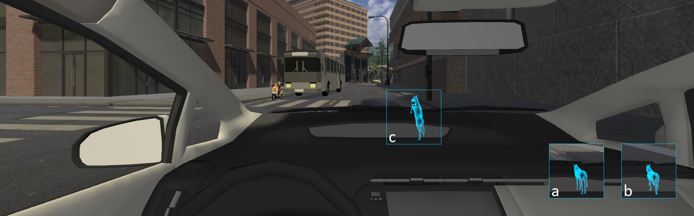

# Virtual Horse: an Anthropomorphic Notification Interface for Traffic Accident Reduction

Fengyusheng Wang, The University of Tokyo

Chia-Ming Chang, The University of Tokyo

Takeo Igarashi, The University of Tokyo

## Abstract

With the development of Vehicle-to-Infrastructure (V2I) and Vehicle-to-Everything (V2X), the difficulty of predicting traffic accidents is decreasing. Vehicles can communicate with each other about their status and receive notifications from traffic infrastructures about the prediction movements of other objects on the road. The efficiency of showing warnings to human drivers will become the bottleneck of reducing traffic accidents.

In this study, we propose Virtual Horse: an anthropomorphic notification interface using implicit information to implicate potential dangers to the driver. The virtual horse represents the car's behaviors and indicates potential dangers via body language like a real horse. We expect this anthropomorphic interface can reduce drivers’ reaction time for preventing dangers. We developed a prototype and ran a pilot study in a web-based driving simulation. The results showed potential benefits of using the proposed interface as well as showing useful insights for our future development of a user study.

## Publication

Fengyusheng Wang, Chia-Ming Chang, and Takeo Igarashi. 2021. Virtual Horse: an Anthropomorphic Notification Interface for Traffic Accident Reduction. In 13th International Conference on Automotive User Interfaces and Interactive Vehicular Applications (AutomotiveUI '21 Adjunct), September 9–14, 2021, Leeds, United Kingdom. ACM, New York, NY, USA 5 Pages. 

https://doi.org/10.1145/3473682.3480255

## Acknowledgement

This work was supported by JST CREST Grant Number JPMJCR17A1, Japan.